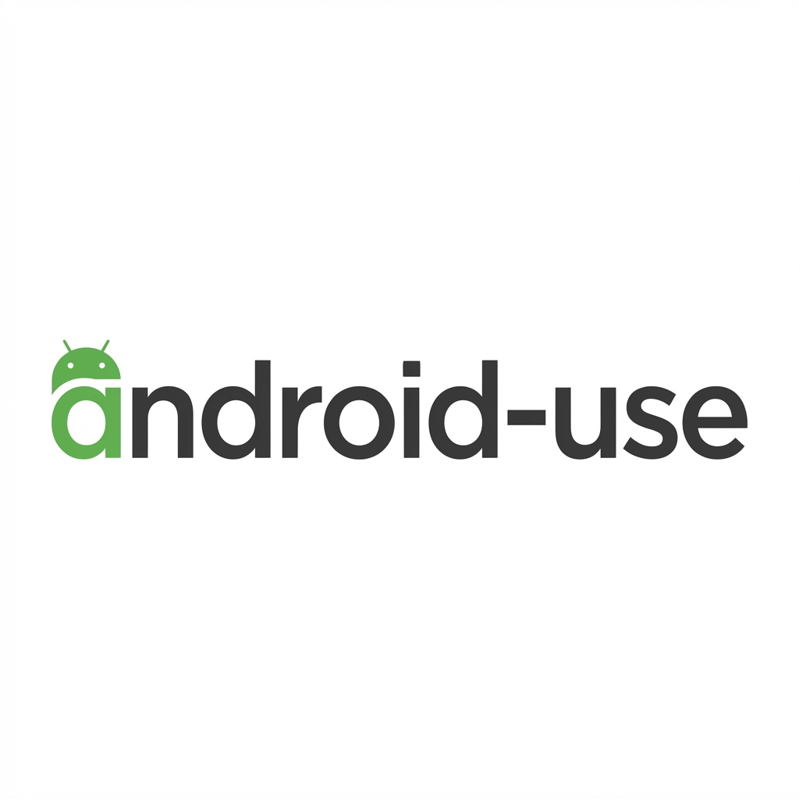

# android-use

<p align="center">
  
</p>

[](https://github.com/iurysza/android-use/releases)
[](https://opensource.org/licenses/MIT)
[](https://bun.sh)

Control Android devices via ADB. Tap, swipe, type, launch apps, and automate UI interactions.

🤖 **Agents, start here:** [Getting Started Guide](./examples/AGENTS_GETTING_STARTED.md)

## Install

```bash
curl -fsSL https://raw.githubusercontent.com/iurysza/android-use/main/install.sh | bash
```

**Prerequisites:** ADB installed, Android device with USB debugging enabled.

## Quick Start

```bash
android-use check-device                # List devices
android-use get-screen                  # Get UI with tap coordinates
android-use tap 540 960                 # Tap at coordinates
android-use type-text "Hello"           # Type text
android-use launch-app com.android.chrome  # Launch app
```

## Documentation

- [Agent Setup Guide](./examples/AGENTS_GETTING_STARTED.md) - Complete setup and usage guide
- [Examples](./examples/) - Tutorials and common patterns
- [Changelog](./CHANGELOG.md)

## License

MIT
